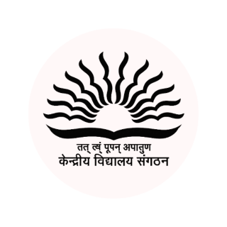

  

<h1 align="center">Kendriya Vidyalaya Sangathan</h1>

  🚀 A student-led, unofficial tech community for KV coders, builders, and dreamers.

---

<h2 align="center">✨ About Us</h2>

  <strong>Kendriya Vidyalaya Developers</strong> is an unofficial student-led organization 
  created to bring together coders, designers, and tech enthusiasts 
  from all Kendriya Vidyalayas across India.

  We aim to: 
  💻 Collaborate on cool open source projects 
  📚 Learn and grow through shared knowledge 
  🎓 Build a strong network of KV student developers 
  🎯 Represent the potential of KV students in tech

---

<h2 align="center">🧑‍💻 How to Join</h2>

  We’re looking for enthusiastic KV students to join us!

  1. DM nandu.js on discord or email at nandubussiness@gmail.com  
  3. Please make sure to mention your github username and affliation to kv  
  4. Get invited to the GitHub org 
  5. Start collaborating and contributing!  
  <strong>No matter your skill level — everyone is welcome here. 🤝</strong>

---

<h2 align="center">🤝 Community</h2>

  We’re building a friendly, beginner-safe space where you can: 
  💬 Ask questions 
  🌟 Showcase your work 
  🧑‍💻 Join coding sessions and events 
  🧠 Learn with fellow KV developers

---

  ⚠️ <strong>This organization is not officially affiliated with Kendriya Vidyalaya Sangathan (KVS).</strong> 
  It is an unofficial, student-led initiative for educational and collaboration purposes.

---

<h2 align="center">⭐ Show Your Support</h2>

  If you love what we’re doing: 
  🌟 Star our repos 
   🎉Share with KV friends 
  💡 Contribute your skills  
  <strong>Together, let’s make KV devs shine! 💛</strong>

---

  Made with ❤️ by KV students

